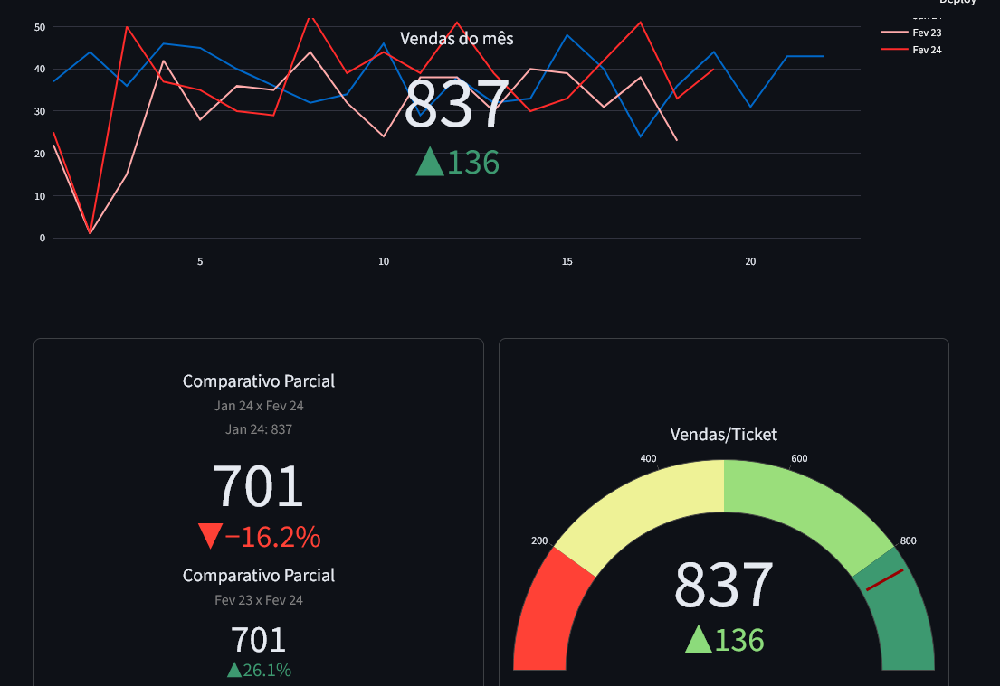

# Dashboard

Projeto em sendo desenvolvido internamente por mim na empresa à qual trabalho. O projeto tem como objetivo criar um dashboard para monitoramento de dados de vendas, estoque, financeiro e outros.

Ainda permanece em desenvolvimento, mas já possui algumas funcionalidades implementadas.

## Tecnologias
 - Python
 - Streamlit
 - Plotly
 - Pandas

## Imagens

- Tela inicial
